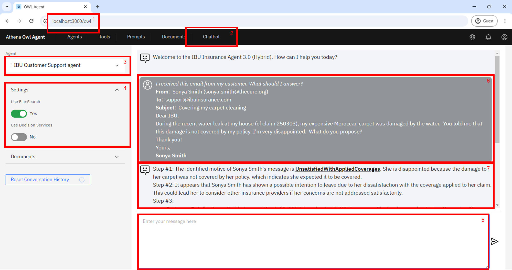

# Athena IBU-Insurance Demo Quickstart
Businesses must follow regulations, internal policies, contract terms, and best practices when making key decisions and responding to customers. In this demo, we'll show you how Hybrid AI can help achieve this.

This demo showcases an Insurance Customer Service scenario where a chatbot, relying solely on pure LLM technology, including Retrieval-Augmented Generation (RAG), produces inaccurate responses that do not align with the insurance carrier's policy.

It then demonstrates the solution: An agentic architecture that orchestrates a rule-based decision service built with IBM Operational Decision Manager ([IBM ODM](https://www.ibm.com/fr-fr/products/operational-decision-manager)) and LLM-based agents available through [watsonx.ai](https://www.ibm.com/products/watsonx-ai).  

This demo, built on the **Athena Owl Agent Framework**, illustrates the power of **Hybrid AI** that combines Gen AI and Symbolic, rule-based AI.

<!-- Commenting out the TOC as MkDocs creates one automatically 
## Table of Contents

1. [Prerequisites](#prerequisites)
2. [Known Limitations](#known-limitations)
3. [Demo Setup](#demo-setup)
4. [Reading and understanding the business policy document](#reading-and-understanding-the-business-policy-document)
5. [Demo Script](#demo-script)
6. [Conclusion](#conclusion)
6. [Call to Action](#call-to-action)
-->

## Prerequisites
Below are the prerequisites to install and run the demo:  

>- [Git](https://git-scm.com/) client in order to get the bootstrap files on your machine.
>- Some API keys, including access to [IBM watsonx.ai](https://www.ibm.com/products/watsonx-ai), see below for all the details.
>- [Docker Compose](https://docs.docker.com/compose/) in order to run the demo, which is a multi-container application.
>      - On Windows, the simplest and recommended approach is to get [Docker Desktop](https://docs.docker.com/desktop/install/windows-install/) as it includes both Docker Engine and Docker Compose required to run the demo.
>      - On Mac you can use either [Docker Desktop](https://docs.docker.com/desktop/install/mac-install/) or [Colima](https://github.com/abiosoft/colima).
>- A web browser. The demo has been thoroughly tested using Google Chrome.

## Demo Setup

### Clone the bootstrap files from GitHub

> - Run `git clone https://github.com/AthenaDecisionSystems/athena-ibm-techxchange.git` from an empty directory.  This creates a subdirectory `athena-ibm-techxchange`

### Create your own `.env` environment file

> - Copy the provided `athena-ibm-techxchange\#.env#` file to `athena-ibm-techxchange\.env`
> - Edit that file and provide your own values for the API keys.  
> 
> - IBM watsonx.ai API keys  
> Accessing IBM watsonx.ai foundation models requires the following keys:  
>> - `WATSONX_APIKEY` and `IBM_WATSONX_APIKEY`: your IBM Cloud user API key. (The same key appears twice in the `.env` file.)  
>> - `IBM_WATSON_PROJECT_ID`: an IBM watsonx.ai project id  
>> - `IBM_WATSONX_URL`: your IBM Datacenter endpoint URL
>>
>If you're new to watsonx.ai, it's simple to get started. Head over to the [IBM watsonx.ai](https://www.ibm.com/products/watsonx-ai) page, where you'll find all the resources needed to set up a Cloud instance. From there, you can begin a free trial. If you don't already have an IBM Cloud account, the setup process will guide you through creating one.  
>>The detailed process for obtaining these keys is described on this page: [How to Create Your watsonx.ai API Keys](ibm-watsonx-api-keys.md)
> 
> - OpenAI API key  
>To get an OpenAI API key, follow these steps:  
>>- Sign up / Log in: go to the [OpenAI Platform](https://platform.openai.com/) and create an account if you don't have one.    
>>- Access API Settings: once logged in, click on your profile icon in the top right corner, then select **View API Keys** from the dropdown menu.  
>>- Generate a new API key: click **Create new secret key**. This will generate a new key that you can copy. You will only be able to view the key once for security reasons, so make sure you save it immediately.  
>>- Paste it in your `.env` file just after `OPENAI_API_KEY=`.

### Grant permission

> - In directory `athena-ibm-techxchange` type `chmod -R 777 decisions`

### Start the Docker images

> - In directory `athena-ibm-techxchange` type `docker compose up -d`
> - This will start the 5 containers required to run the demo 
> - The first time you run that command, this will first pull the Docker images and create the containers

Follow the progress of the pull/build/start process in Docker Desktop or in Colima. As soon as the CPU stabilizes, you can proceed with the following tasks.

### Upload the policy document to the vector store

The first stage of the demo relies on the Retrieval-Augmented Generation (RAG) mechanism. To prepare for this, you will need to upload the policy document, split it into chunks, and store the chunks in the vector database.  

Please execute the tasks below:

> Task 1. Visit [the demo UI](http://localhost:3000/)  
> Task 2. Click on the **Chatbot** option located in the top menu  
> Task 3. Click on the **Documents** accordion located on the left-hand-side  
> Task 4. Click on the **IBU Policies document** link  

The following image shows tasks 2-4: 

    

> Task 5. This opens the **Complaint Management Customer Retention Policy** pdf document in a new tab  
> Task 6. Click the Download link on your browser to store it locally

  The following image shows tasks 5-6: 

  

> Task 7. Click on the **Documents** option located in the top menu  
> Task 8. Click on the **Select a file to upload** link  

The following image shows tasks 7-8: 

  

> Task 9. Select the `IBUpolicies.pdf` file that you just uploaded  

As a result, the document is divided into chunks and stored in the vector store, making it ready for retrieval. 

## Reading and understanding the business policy document

Check the `IBUpolicies.pdf` document. Pay special attention to the two following rules, that will be eligible in the demo scenario:

> - `AC-HOME-CONT-UP`. This rule stipulates that an upsell to the home policy should be proposed to customers under certain conditions
> - `AC-HOME-CONT-VOUCHER` - That rule states that the CSR should offer a voucher for additional services from an affiliate provider under certain conditions

## Demo Script

### Stage I - Chat in RAG/File Search only mode

In this first stage of the demo (Pure Gen AI), we will rely on pure LLM mechanisms and figure out what is going to happen.

Please follow the following script, as illustrated in the following image: 

> Task 1. Visit [the demo UI](http://localhost:3000/)  
> Task 2. Click on the **Chatbot** option located in the top menu  
> Task 3. Make sure **IBU Customer Support agent** is selected in the **Agent** list on the left  
> Task 4. Make sure the **Settings** buttons show

>    - **Use File Search**: **Yes**  
>    *This indicates that we are going to append the relevant chunks of the policy document to the prompt*
>    - **Use Decision Services**: **No**  
>    *This indicates that we are going to rely on the LLM (limitted) reasoning capabilities to handle the client complaint*

> Task 5. In the text input box, type `demo`

`demo` is a shortcut for typing the following message from the Customer Service Representative:

> ***User***
>> *I received this email from my customer. What should I answer?*
>>
>> **From**:  Sonya Smith (sonya.smith@thecure.org)
>>
>> **To**:  support@ibuinsurance.com
>>
>> **Subject**:  Covering my carpet cleaning
>>
>> Dear IBU,
>>
>> During the recent water leak at my house (cf claim 250303), my expensive Moroccan carpet was damaged by the water.  You told me that this damage is not covered by my policy. I’m very disappointed. What do you propose?
>>
>> Thank you!
>>
>> Yours,
>>
>> **Sonya Smith**

Press the **Enter** key

> Task 6. As a first outcome, the CSR message shows in the chat window  
> Task 7. As a second outcome, the chatbot response shows in the chat window

Below is the output we are getting. LLMs do not behave deterministically so you might have something slightly different:

> ***Chatbot***
>> **Step #1**: The identified motive of Sonya Smith's message is UnsatisfiedWithAppliedCoverages. She is disappointed because the damage to her carpet, which she expected to be covered, is not included in her policy.
>>
>> **Step #2**: It appears that Sonya Smith has shown a possible intention to leave due to her dissatisfaction with the coverage applied to her claim. This could lead her to consider other insurance providers if her concerns are not addressed satisfactorily.
>>
>> **Step #3**:
>>
>> Customer Details: Sonya Smith, born on March 12, 1999, is a client with IBU Insurance. She has been a client since November 12, 2023.
> Current Policies: Sonya holds a Home policy (HomeBuildingsOnly) effective from June 6, 2023, to June 6, 2024. The policy includes various coverages for water damage, fire, wind, and other damages, with a deductible of $3,000 for each coverage.
> Current Claims: Claim number 250303 is currently in process and verified. It includes damages from a water leak affecting her house, specifically a damaged carpet and wooden flooring. The carpet damage is not covered under her current policy, which is the source of her disappointment. 
>> 
>> **Step #4**:
>>
>>Recommendations: I recommend reaching out to Sonya to explain the specific reasons why the carpet damage is not covered under her current policy. It may be beneficial to review her policy details with her and discuss potential options for additional coverage in the future. Additionally, offering to assist her in understanding her policy better could help alleviate her dissatisfaction and potentially retain her as a client.

The outcome of Steps #1 to #3 is correct but the LLM failed in Step #4 to recommend the CSR to offer a voucher while the conditions of rule `AC-HOME-CONT-VOUCHER` apply:

> `A voucher with a market value of up to 200€ should be offered to customers in the following
situation:
> - Their policy covers only home structures, not the content ;
> - The reason of their interaction is that they are not satisfied with the coverage;
> - The customer policy has more than 180 days
> - Their CLTV percentile is at least 60`

Let's try and challenges Step 4:  
> Task 8. Type the following prompt:

> ***User***  
>> Doesn't rule AC-HOME-CONT-VOUCHER apply here?  

In our case the chatbot did recognize its omission the first time:  
> ***Chatbot***  
>> ...  
>> **Step #4**: Recommendations: Given that the **AC-HOME-CONT-VOUCHER** rule applies here, I recommend offering Sonya a voucher with a market value of up to 200€. This is appropriate because her policy covers only home structures, she is dissatisfied with the coverage, her policy has been active for more than 180 days, and we should check her CLTV percentile to ensure it meets the requirement of at least 60. This gesture could help alleviate her dissatisfaction and potentially retain her as a client. Additionally, I suggest explaining the specific reasons why the carpet damage is not covered under her current policy and discussing potential options for additional coverage in the future.

### What did Stage I show?

Stage I first demonstrated that the agentic architecture supporting the chatbot guarantees some level of control and the following process flow:
> - **Step #1**: Identify the motive of the customer's request
> - **Step #2**: Assess the customer's risk of churn
> - **Step #3**: Get the customer's detail from the external customer database
> - **Step #4**: By reconcilliating the insight extracted from the email (Steps #1 and #2) and customer database data (Step #3), determine what rules from the policy document apply

But it also illustrated two major drawbacks when using LLMs to reason in Step #4:  
>- Hallucinations  
>- Non reproducibility  

**We need a solution!**

### Stage II - Chat in RAG/File Search + Use Decision Service mode

In this second stage of the demo (Hybrid AI), we rely on a hybrid combination of LLM and rule-based decision automation to run Step #4.

Please follow the tasks from section [Stage I - Chat in RAG/File Search only mode](#stage-i---chat-in-ragfile-search-only-mode) but this time, make sure the **Settings** buttons show:

>   - **Use File Search**: **Yes**  
>   *This indicates that we are going to append the relevant chunks of the policy document to the prompt*
>   - **Use Decision Services**: **Yes**  
>   *This indicates that we are going to rely on IBM ODM deterministic reasoning capabilities to handle the client complaint*  

This time, we are getting the expected behavior, as shown on the following image: 

.

In addition to that, two links show:  

- The **Justification** link. Clicking this link displays the rules' descriptions exactly as they appear in the Policy Document, as illustrated in the image below:
 
 
  
 
 
- The **Rules** link. Clicking that link shows the rules as they are entered and maintained in IBM ODM, as shown in the following image:  
 
  

Ask a subsequent question:

> ***User***  
>> Where can Sonya find such an affiliate? She lives in Nevada

Below is the response we are getting (Yours might be slightly different):

> ***Chatbot***  
>> Sonya can find an affiliate provider for carpet cleaning in Nevada at Chem-Dry, located at 1000 N. 4th St., Suite 200, Las Vegas, NV 89101.  

Here the chatbot did not call a Decision Service, but rather found the appropriate response in the uploaded Policy Document and returned the only relevant entry:

> ***List of affiliated providers to IBU insurance***  
> 
> **Carpet cleaner**
> 1. Stanley Steemer, Address: 1000 W. 14th St., Canton, OH 44703
> 2. Chem-Dry, Address: 1000 N. 4th St., Suite 200, **Las Vegas, NV 89101**
> 3. Oxi Fresh Carpet Cleaning, Address: 1234 S. 5th St., Denver, CO 80204  
>
> **Auto repair**
> 1. Hawthorne Auto Clinic, Address: 3939 SE Hawthorne Blvd, Portland, OR 97214
> 2. Steve's Imports, Address: 12345 SW 68th Ave, Portland, OR 97223
> 3. K&M Auto Service, Address: 1234 NE 12th Ave, Portland, OR 97232  
>
> **Home repair**
> 1. Mr. Handyman, Address: 1234 Main St, Suite 100, Anytown, USA 12345
> 2. Home Repair Services, Address: 5678 Elm St, Springfield, USA 67890
> 3. HOME, Address: 9101 Oak Ave, Suite 200, Metropolis, USA 23456

### What did Stage II show?  

That second stage demonstrated that integrating the rule-based Decision Service in the agentic architecture:  
>- Ensures that the right, context-aware, recommendation is given to the CSR  
>- Provides a deterministic justification based on the Policy Document and that makes sense to the Customer Service Representative  
>- Provides the list of rules that fired in the IBM ODM engine for both tuning and auditing purposes  
>- Allows to take advantage of Gen AI mechanisms, such as RAG, when it makes sense as in the list of affiliate providers example

## Conclusion

That demo showed that by integrating a rule-based Decision Service in an agentic architecture, we are getting the best of both worlds:

>- **Rule-based Decision Services** allow correct, reproducible, explainable contextual decisions based on rules that can be understood and maintained by Business Analysts. They are the right approach to implementing highly contextual decision services that implement best practices, policies and regulations.
>- **LLMs** are key to allow agency, seamless and fluid communication with the Humans 

**Combining them is what Hybrid AI is all about and allows to build robust chatbots, chatbots that work!**

## Call to Action

Reach out to us, as we'd love to have a conversation:

>  - [Contact us](https://athenadecisions.com/contact-us)
>  - Even better, [Schedule a 30-minute conversation](https://calendly.com/harley-6-ar/30min?month=2024-10)

Create your own demos using the **Athena Owl Agent open-source Framework** and even contribute to its development. The framework will be made publicly available in the coming days.

## Known Limitations

The following limitations are known and will be fixed promptly

> - If you create rules in the ODM Decision Center and deploy them to the ODM Rule Execution Server, they will execute as expected but will not show as justifications, even if they fire
> - You'll have to manually grant read, write, and execute permissions on the `decisions` directory
> - Chat history is erased when you leave the Chatbot page by clicking another tab

## FAQ

### How to empty the Vector Store?
To empty the Vector Store where the Policy Document is stored, please apply the following procedure
> - Stop the `ibu-backend` container. If you are using **Docker Desktop**, the preferred way is to go to the **Containers** page and click the **Stop** icon  on the `ibu-backend` line
> - Delete the content of subdirectory `athena-ibm-techxchange/data/vs_db` except the `.keep` file 
> - Delete the content of subdirectory `athena-ibm-techxchange/data/file_content` except the `.keep` file 
> - Restart the `ibu-backend` container